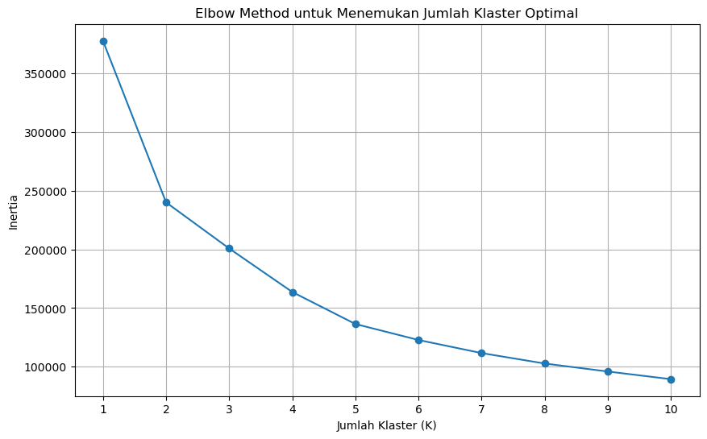
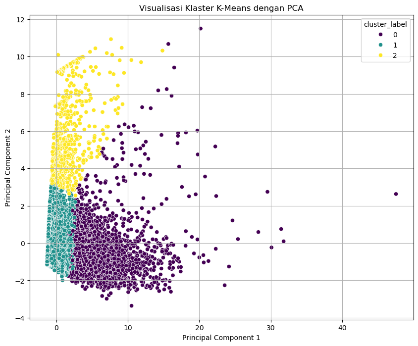

# Analisis-Segmentasi-Pelanggan-Maskapai
Proyek ini bertujuan untuk mengidentifikasi segmen pelanggan yang berbeda dalam bisnis maskapai penerbangan menggunakan metode unsupervised machine learning dengan dataset yang diambil dari **Kaggle**. Hasilnya digunakan untuk memberikan rekomendasi bisnis yang terfokus.

# Tujuan Proyek
- Menganalisis data penerbangan untuk mendapatkan wawasan awal.
- Melakukan feature engineering untuk membuat fitur yang lebih informatif.
- Mengelompokkan pelanggan dengan algoritma K-Means.
- Menginterpretasi hasil klaster dan memberikan rekomendasi bisnis strategis.

# Metodologi:
1. EDA: Analisis data awal untuk menemukan pola dan korelasi.
2. Data Preprocessing: Mengatasi nilai yang hilang, mengubah data kategorikal, dan menstandardisasi fitur.
3. Modeling: Menggunakan Elbow Method untuk menentukan jumlah klaster optimal dan menerapkan K-Means Clustering.
4. Evaluasi: Menganalisis hasil klaster dengan visualisasi PCA dan memberikan interpretasi bisnis.

# Hasil & Temuan Utama
Statistik Rata-rata Fitur per Klaster:
               FLIGHT_COUNT  SEG_KM_SUM  Points_Sum  EXCHANGE_COUNT  FFP_TIER  \
cluster_label                                                                   
0                     46.26    64617.32    57358.06            2.20         5   
1                      8.90    12445.48     8268.25            0.15         4   
2                      5.19    41084.21    27809.96            0.31         4   

               AVG_DISTANCE_PER_FLIGHT  
cluster_label                           
0                              1494.81  
1                              1461.28  
2                              8349.17  

  
  

